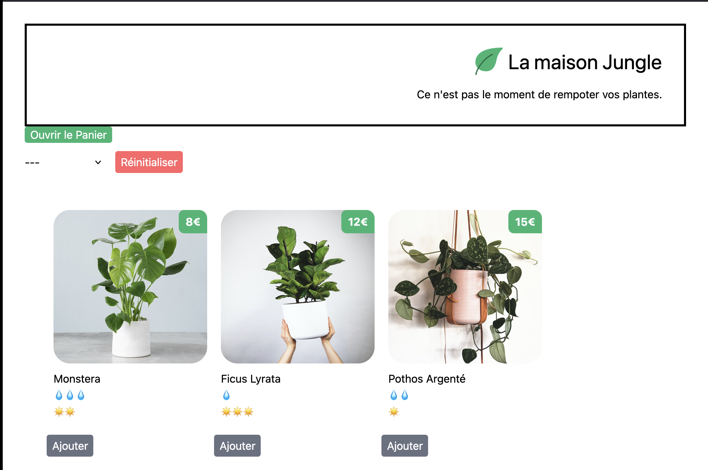

# La Maison Jungle



## Présentation

Bienvenue dans le projet **La Maison Jungle**. Ce projet fait partie du cours d'introduction à react sur Openclassroom.

## Objectif

L'objectif de ce projet est de en compétence en React, une bibliothèque JavaScript populaire pour la création d'interfaces utilisateur. En travaillant sur **La Maison Jungle**, je vais :

- Apprendre les bases de React, y compris les composants, les props et l'état.
- Comprendre comment structurer une application React et organiser votre code.
- Découvrir comment gérer les événements et les interactions utilisateur.
- Explorer les techniques de gestion de l'état avec des hooks comme `useState` et `useEffect`.
- Intégrer des fonctionnalités avancées telles que le filtrage, la recherche, etc....
- Améliorer mes compétences en développement front-end en utilisant des outils modernes comme pnpm et des gestionnaires de paquets.

Ce projet est conçu pour être à la fois éducatif et pratique, me permettre de construire une application réelle tout en consolidant mes connaissances en React.

## Fonctionnalités de base

- **Catalogue de Plantes** : Affiche une liste de plantes avec des détails tels que le nom, la description, et les besoins en lumière et en eau.
- **Recherche** : Permet de rechercher des plantes par nom ou par catégorie.
- **Filtrage** : Filtre les plantes par besoins spécifiques (lumière, eau, etc.).
- **Ajout au panier** : Permettre d'ajouter un item au panier.
- **Mise en cache** : Enregistrement du panier dans le local storage

## Fonctionnalité rajouté par moi

- **Filtrage des article par catégorie** : Afficher des produits en fonction de la catégorie choisie

## Fonctionnalité à venir

- **Filtrage avec plusieurs catégories** : Afficher la liste des produits en fonction d'une ou plusieurs catégories

## Installation

Pour installer et exécuter ce projet localement, suivez ces étapes :

1. Clonez le dépôt :

```bash
git clone https://github.com/votre-utilisateur/la-maison-jungle.git
```

2. Accédez au répertoire du projet :

```bash
cd la-maison-jungle
```

3. Installez les dépendances :

```bash
npm install
```

4. Démarrez l'application :

```bash
npm start
```

## Contribution

Les contributions sont les bienvenues ! Veuillez soumettre une pull request ou ouvrir une issue pour discuter des changements que vous souhaitez apporter.

## Licence

Ce projet est sous licence MIT. Voir le fichier [LICENSE](LICENSE) pour plus de détails.

## Auteurs

- **Guy B** - Futur développeur full-stack
